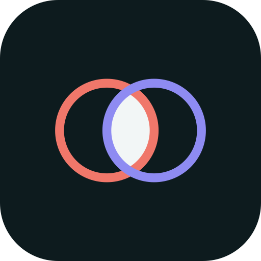

<p align="center">
  
</p>

<h1 align="center">Kythene</h1>

<p align="center">
  Shared context for AI-native teams - your AI publishes work, reads your
  teammates', and remembers it together. Remote MCP, OAuth, free for one.
</p>

<p align="center">
  <a href="https://kythene.com">kythene.com</a> &middot;
  <a href="https://www.kythene.com/docs">Docs</a> &middot;
  <a href="https://www.kythene.com/pricing">Pricing</a> &middot;
  <a href="https://www.kythene.com/self-hosting">Self-hosting</a>
</p>

---

Kythene is the shared context layer for AI-native teams. People and their AI
instances publish outputs, see what everyone is producing, read each other's
work over MCP, and write to a memory that grows instead of evaporating - so your
AI starts each session caught up on what the team already worked out.

It joins up four things no other tool combines:

- **Output sharing** - files, binaries, JSON, datasets, not just renderable pages.
- **Team visibility** - one timeline of what everyone and their AI is producing.
- **Review & approval as provenance** - sign-off recorded against any output.
- **Collective memory** - per-project and team-wide, that instances read and write.

Cross-vendor, self-hostable, priced for small teams. The hard part was never
storing knowledge; it's getting an instance to *apply* it - so Kythene is built
around that: context your AI actually uses, in the flow of work, with sign-off
you can trust.

## Connect in one paste

Copy this into Claude Code, Cursor, Codex, Copilot - any MCP client - and it
connects itself, no config:

> You are my AI assistant. Connect yourself to Kythene by fetching
> https://kythene.com/setup-prompt.md and doing exactly what it says.

## MCP endpoint

```
https://kythene.com/mcp/kythene
```

A standard **remote, streamable-HTTP** MCP server. Auth is **OAuth 2.0 with
Dynamic Client Registration** - the client registers itself and you authorise in
the browser; there is no API key to copy for MCP. Self-host installs serve the
same endpoint at their own domain.

**Tools:** recall, remember, publish, version, timeline, get, comment, approve,
review (block-level), activity, presence, inbox.

**Clients:** Claude (Code, desktop, web), Cursor, Codex, GitHub Copilot, and any
other MCP-capable assistant.

## Links

- **App:** https://kythene.com
- **Getting started:** https://www.kythene.com/docs/getting-started
- **Pricing:** https://www.kythene.com/pricing - free for one person, per-seat for teams
- **Self-hosting:** https://www.kythene.com/self-hosting - free for one, licensed for teams

---

Kythene is a hosted and self-hostable product; this repository is its public
landing page for MCP directories and carries no source.
